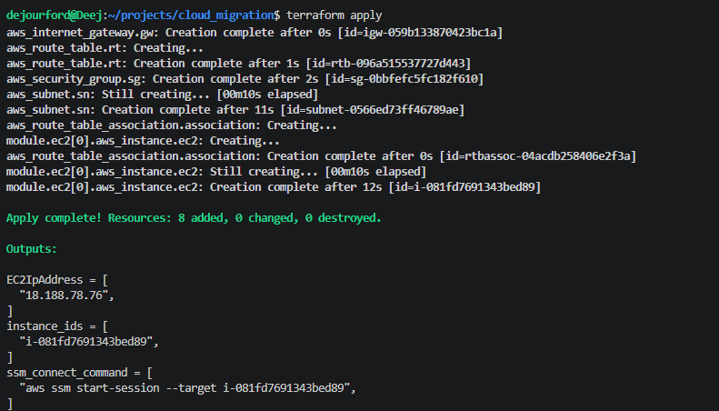
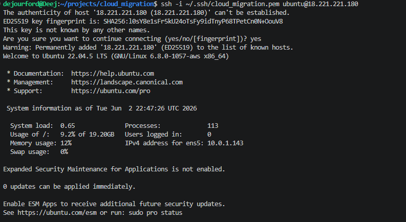
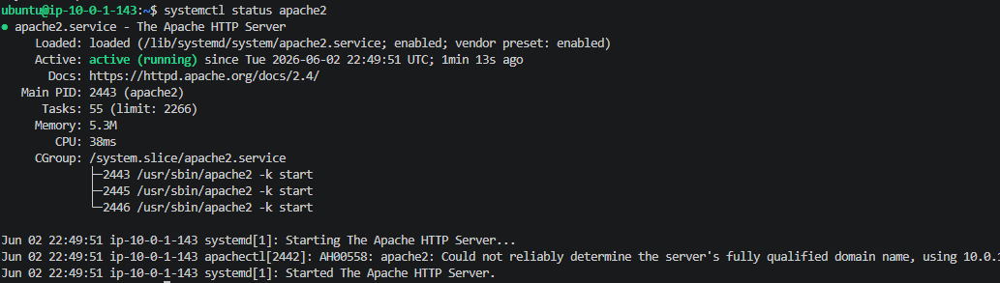
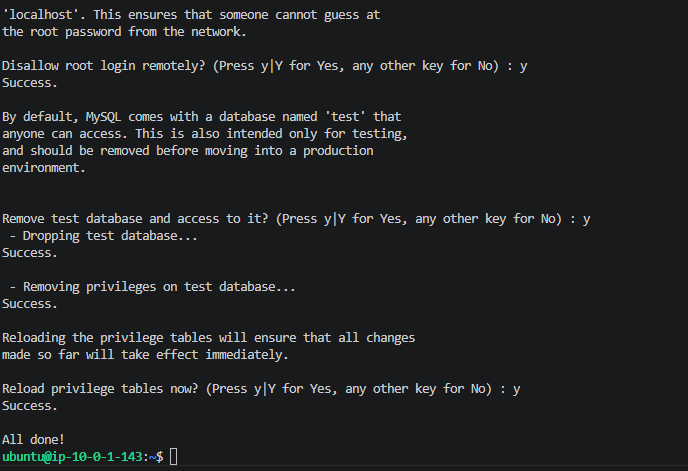
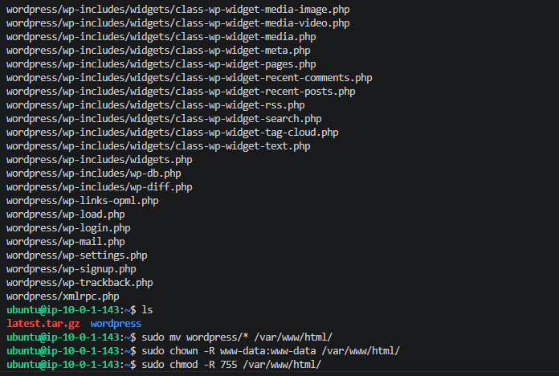
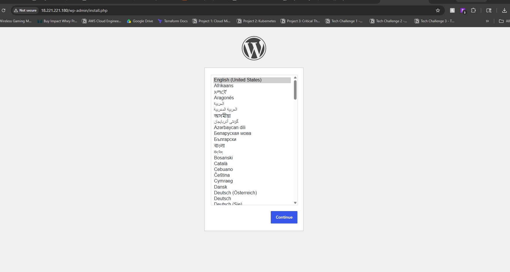
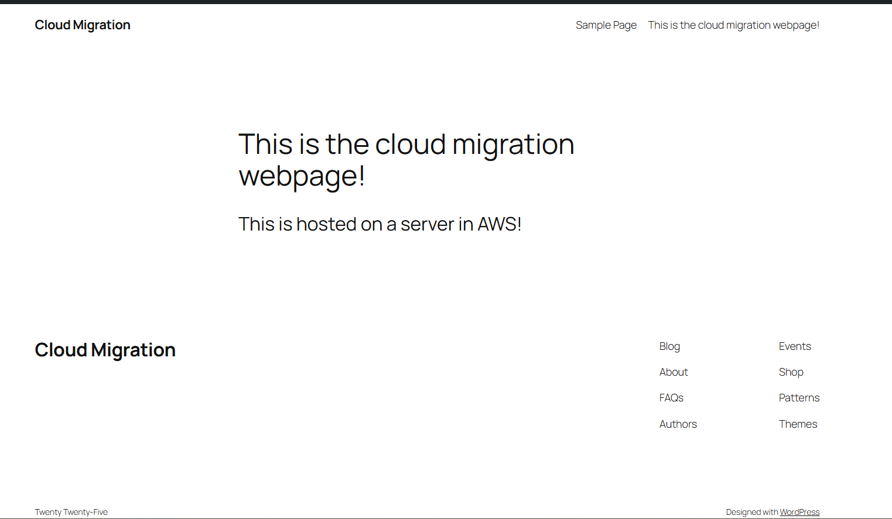

# Cloud Migration

## Objective
This project simulates migrating a company's legacy applications and databases to AWS (Amazon Web Services). The goal is to modernize the infrastructure, improve security, and build a system capable of scaling with demand.

The migration involves provisioning a virtual server (EC2), installing a LAMP stack (Linux, Apache, MySQL, PHP), and deploying WordPress as the web platform.

## Architecture
- **Cloud Provider:** AWS
- **Compute:** EC2 (t3.micro)
- **Web Server:** Apache
- **Database:** MySQL
- **Language:** PHP
- **Platform:** WordPress
- **Infrastructure as Code:** Terraform

## Procedure

1. Provisioned AWS infrastructure using Terraform

2. SSH'd into EC2 instance

3. Installed and configured Apache web server

4. Installed and secured MySQL

5. Installed PHP and required extensions

6. Deployed WordPress

7. Confirmed WordPress site live

## Results

Successfully deployed a fully functional WordPress site on AWS. The LAMP stack (Linux, Apache, MySQL, PHP) was configured on an EC2 instance provisioned with Terraform, and WordPress was accessible via the public IP over HTTP.

## Lessons Learned
*To be completed.*
